# Architectural Diagrams - Healthcare Management System

## Table of Contents

1. [High-Level System Architecture](#1-high-level-system-architecture)
2. [Microservices Architecture](#2-microservices-architecture)
3. [Database Schema Diagram](#3-database-schema-diagram)
4. [Authentication & Authorization Flow](#4-authentication--authorization-flow)
5. [Respiratory Analysis (ML Pipeline) Flow](#5-respiratory-analysis-ml-pipeline-flow)
6. [WebSocket Real-Time Chat Architecture](#6-websocket-real-time-chat-architecture)
7. [Appointment Management Flow](#7-appointment-management-flow)
8. [Frontend Component Architecture](#8-frontend-component-architecture)
9. [API Endpoint Map](#9-api-endpoint-map)
10. [Deployment Architecture](#10-deployment-architecture)
11. [Security Architecture](#11-security-architecture)
12. [Notification System Flow](#12-notification-system-flow)

---

## 1. High-Level System Architecture

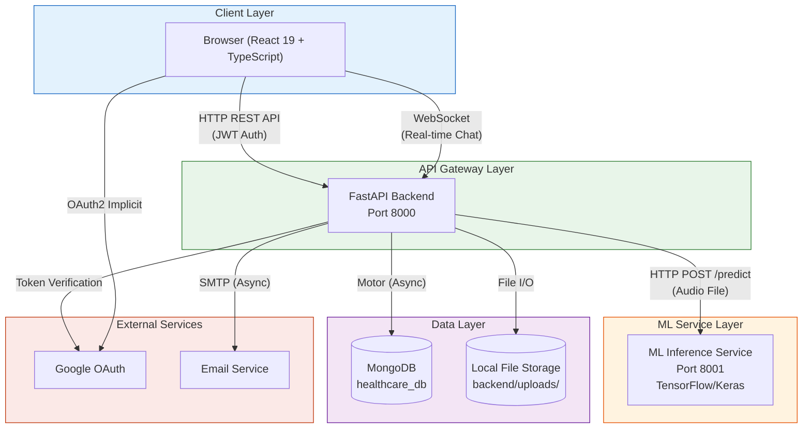
```mermaid
graph TB
    subgraph Client["Client Layer"]
        Browser["Browser (React 19 + TypeScript)"]
    end

    subgraph API["API Gateway Layer"]
        Backend["FastAPI Backend<br/>Port 8000"]
    end

    subgraph ML["ML Service Layer"]
        MLService["ML Inference Service<br/>Port 8001<br/>TensorFlow/Keras"]
    end

    subgraph Data["Data Layer"]
        MongoDB[(MongoDB<br/>healthcare_db)]
        FileStore[("Local File Storage<br/>backend/uploads/")]
    end

    subgraph External["External Services"]
        Google["Google OAuth"]
        Email["Email Service"]
    end

    Browser -->|"HTTP REST API<br/>(JWT Auth)"| Backend
    Browser -->|"WebSocket<br/>(Real-time Chat)"| Backend
    Backend -->|"HTTP POST /predict<br/>(Audio File)"| MLService
    Backend -->|"Motor (Async)"| MongoDB
    Backend -->|"File I/O"| FileStore
    Backend -->|"Token Verification"| Google
    Backend -->|"SMTP (Async)"| Email
    Browser -->|"OAuth2 Implicit"| Google

    style Client fill:#E3F2FD,stroke:#1565C0
    style API fill:#E8F5E9,stroke:#2E7D32
    style ML fill:#FFF3E0,stroke:#E65100
    style Data fill:#F3E5F5,stroke:#6A1B9A
    style External fill:#FBE9E7,stroke:#BF360C
```

---

## 2. Microservices Architecture

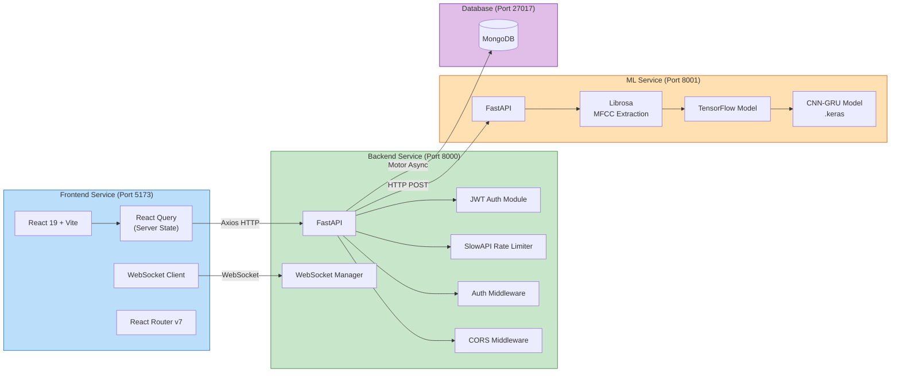
```mermaid
graph LR
    subgraph Frontend["Frontend Service (Port 5173)"]
        React["React 19 + Vite"]
        RQ["React Query<br/>(Server State)"]
        WS_Client["WebSocket Client"]
        Router["React Router v7"]
    end

    subgraph Backend_Service["Backend Service (Port 8000)"]
        FastAPI["FastAPI"]
        JWT["JWT Auth Module"]
        WS_Server["WebSocket Manager"]
        RateLimiter["SlowAPI Rate Limiter"]
        Middleware["Auth Middleware"]
        CORS["CORS Middleware"]
    end

    subgraph ML_Service["ML Service (Port 8001)"]
        FastAPI_ML["FastAPI"]
        TF["TensorFlow Model"]
        Librosa["Librosa<br/>MFCC Extraction"]
        Model["CNN-GRU Model<br/>.keras"]
    end

    subgraph Database["Database (Port 27017)"]
        Mongo[(MongoDB)]
    end

    React --> RQ
    RQ -->|"Axios HTTP"| FastAPI
    WS_Client -->|"WebSocket"| WS_Server
    FastAPI --> JWT
    FastAPI --> RateLimiter
    FastAPI --> Middleware
    FastAPI --> CORS
    FastAPI -->|"Motor Async"| Mongo
    FastAPI -->|"HTTP POST"| FastAPI_ML
    FastAPI_ML --> Librosa --> TF
    TF --> Model

    style Frontend fill:#BBDEFB,stroke:#1565C0
    style Backend_Service fill:#C8E6C9,stroke:#2E7D32
    style ML_Service fill:#FFE0B2,stroke:#E65100
    style Database fill:#E1BEE7,stroke:#6A1B9A
```

---

## 3. Database Schema Diagram

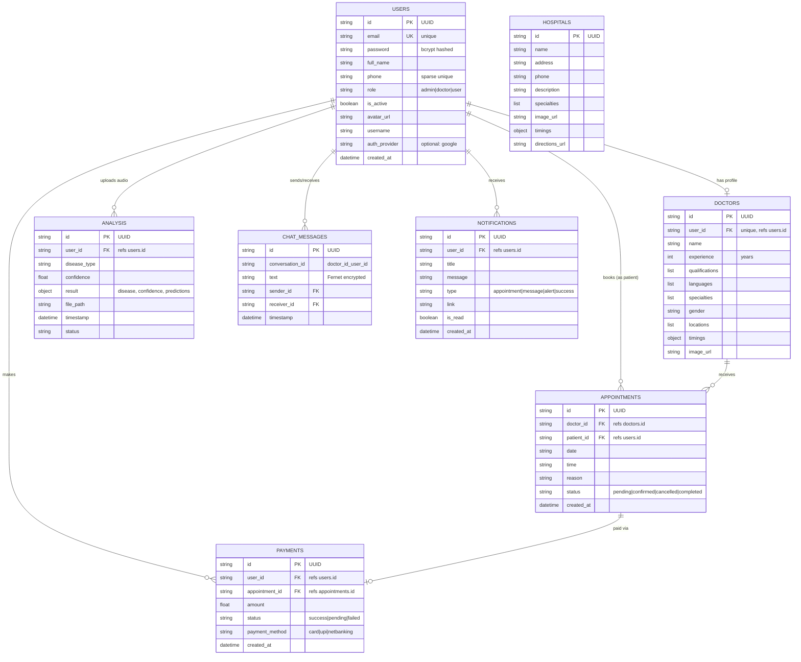
```mermaid
erDiagram
    USERS {
        string id PK "UUID"
        string email UK "unique"
        string password "bcrypt hashed"
        string full_name
        string phone "sparse unique"
        string role "admin|doctor|user"
        boolean is_active
        string avatar_url
        string username
        string auth_provider "optional: google"
        datetime created_at
    }

    DOCTORS {
        string id PK "UUID"
        string user_id FK "unique, refs users.id"
        string name
        int experience "years"
        list qualifications
        list languages
        list specialties
        string gender
        list locations
        object timings
        string image_url
    }

    HOSPITALS {
        string id PK "UUID"
        string name
        string address
        string phone
        string description
        list specialties
        string image_url
        object timings
        string directions_url
    }

    APPOINTMENTS {
        string id PK "UUID"
        string doctor_id FK "refs doctors.id"
        string patient_id FK "refs users.id"
        string date
        string time
        string reason
        string status "pending|confirmed|cancelled|completed"
        datetime created_at
    }

    ANALYSIS {
        string id PK "UUID"
        string user_id FK "refs users.id"
        string disease_type
        float confidence
        object result "disease, confidence, predictions"
        string file_path
        datetime timestamp
        string status
    }

    CHAT_MESSAGES {
        string id PK "UUID"
        string conversation_id "doctor_id_user_id"
        string text "Fernet encrypted"
        string sender_id FK
        string receiver_id FK
        datetime timestamp
    }

    NOTIFICATIONS {
        string id PK "UUID"
        string user_id FK "refs users.id"
        string title
        string message
        string type "appointment|message|alert|success"
        string link
        boolean is_read
        datetime created_at
    }

    PAYMENTS {
        string id PK "UUID"
        string user_id FK "refs users.id"
        string appointment_id FK "refs appointments.id"
        float amount
        string status "success|pending|failed"
        string payment_method "card|upi|netbanking"
        datetime created_at
    }

    USERS ||--o| DOCTORS : "has profile"
    USERS ||--o{ APPOINTMENTS : "books (as patient)"
    DOCTORS ||--o{ APPOINTMENTS : "receives"
    USERS ||--o{ ANALYSIS : "uploads audio"
    USERS ||--o{ CHAT_MESSAGES : "sends/receives"
    USERS ||--o{ NOTIFICATIONS : "receives"
    USERS ||--o{ PAYMENTS : "makes"
    APPOINTMENTS ||--o| PAYMENTS : "paid via"
```

---

## 4. Authentication & Authorization Flow

### 4.1 Login Flow

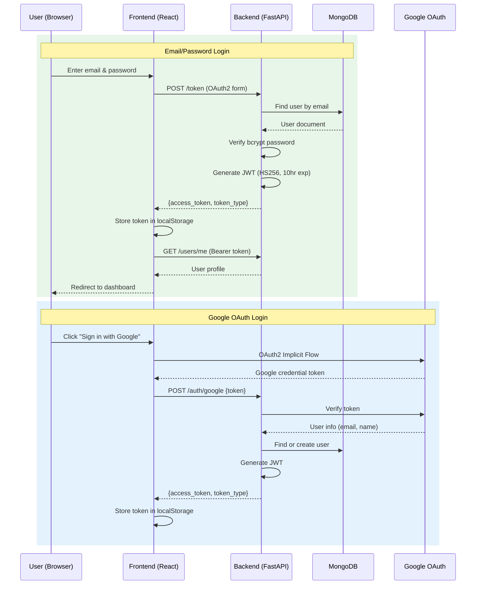
```mermaid
sequenceDiagram
    participant U as User (Browser)
    participant F as Frontend (React)
    participant B as Backend (FastAPI)
    participant DB as MongoDB
    participant G as Google OAuth

    rect rgb(232, 245, 233)
        Note over U,DB: Email/Password Login
        U->>F: Enter email & password
        F->>B: POST /token (OAuth2 form)
        B->>DB: Find user by email
        DB-->>B: User document
        B->>B: Verify bcrypt password
        B->>B: Generate JWT (HS256, 10hr exp)
        B-->>F: {access_token, token_type}
        F->>F: Store token in localStorage
        F->>B: GET /users/me (Bearer token)
        B-->>F: User profile
        F-->>U: Redirect to dashboard
    end

    rect rgb(227, 242, 253)
        Note over U,G: Google OAuth Login
        U->>F: Click "Sign in with Google"
        F->>G: OAuth2 Implicit Flow
        G-->>F: Google credential token
        F->>B: POST /auth/google {token}
        B->>G: Verify token
        G-->>B: User info (email, name)
        B->>DB: Find or create user
        B->>B: Generate JWT
        B-->>F: {access_token, token_type}
        F->>F: Store token in localStorage
    end
```

### 4.2 Role-Based Access Control

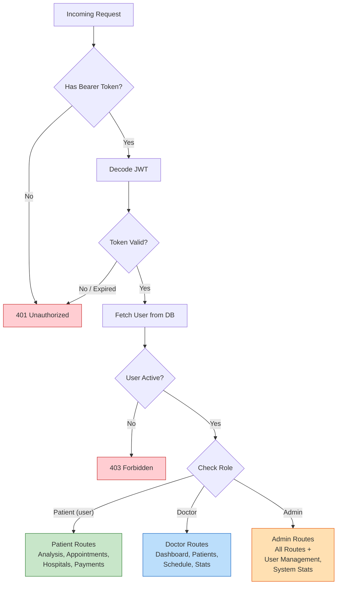
```mermaid
graph TD
    Request["Incoming Request"] --> AuthCheck{"Has Bearer Token?"}

    AuthCheck -->|No| Reject401["401 Unauthorized"]
    AuthCheck -->|Yes| Decode["Decode JWT"]

    Decode --> Valid{"Token Valid?"}
    Valid -->|No / Expired| Reject401

    Valid -->|Yes| FetchUser["Fetch User from DB"]
    FetchUser --> Active{"User Active?"}
    Active -->|No| Reject403["403 Forbidden"]

    Active -->|Yes| RoleCheck{"Check Role"}

    RoleCheck -->|"Patient (user)"| PatientRoutes["Patient Routes<br/>Analysis, Appointments,<br/>Hospitals, Payments"]
    RoleCheck -->|"Doctor"| DoctorRoutes["Doctor Routes<br/>Dashboard, Patients,<br/>Schedule, Stats"]
    RoleCheck -->|"Admin"| AdminRoutes["Admin Routes<br/>All Routes +<br/>User Management,<br/>System Stats"]

    style Reject401 fill:#FFCDD2,stroke:#C62828
    style Reject403 fill:#FFCDD2,stroke:#C62828
    style PatientRoutes fill:#C8E6C9,stroke:#2E7D32
    style DoctorRoutes fill:#BBDEFB,stroke:#1565C0
    style AdminRoutes fill:#FFE0B2,stroke:#E65100
```

### 4.3 JWT Token Structure

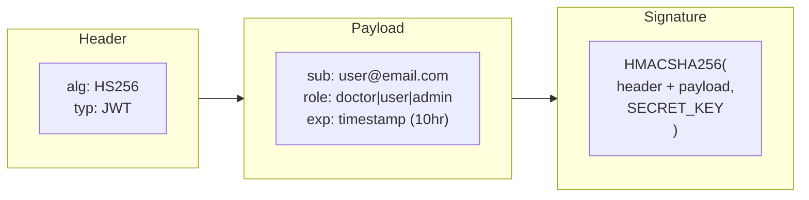
```mermaid
graph LR
    subgraph Header
        A["alg: HS256<br/>typ: JWT"]
    end
    subgraph Payload
        B["sub: user@email.com<br/>role: doctor|user|admin<br/>exp: timestamp (10hr)"]
    end
    subgraph Signature
        C["HMACSHA256(<br/>header + payload,<br/>SECRET_KEY<br/>)"]
    end

    Header --> Payload --> Signature
```

---

## 5. Respiratory Analysis (ML Pipeline) Flow

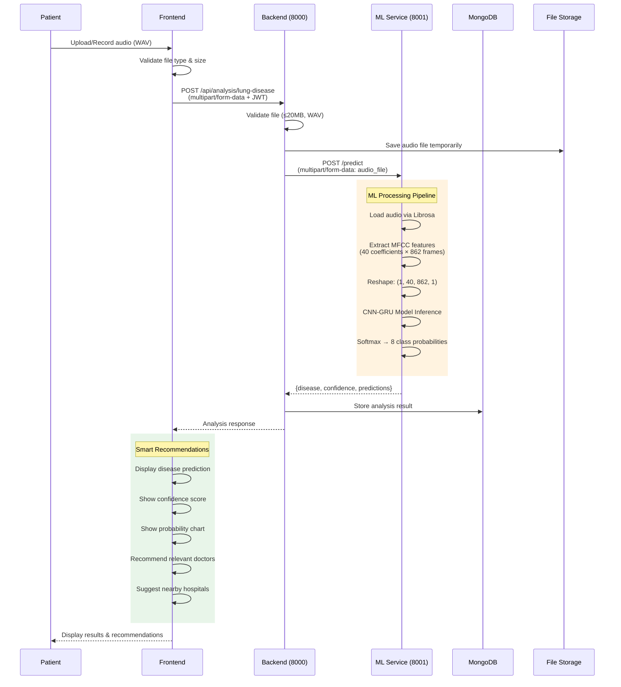
```mermaid
sequenceDiagram
    participant P as Patient
    participant F as Frontend
    participant B as Backend (8000)
    participant ML as ML Service (8001)
    participant DB as MongoDB
    participant FS as File Storage

    P->>F: Upload/Record audio (WAV)
    F->>F: Validate file type & size

    F->>B: POST /api/analysis/lung-disease<br/>(multipart/form-data + JWT)
    B->>B: Validate file (≤20MB, WAV)
    B->>FS: Save audio file temporarily

    B->>ML: POST /predict<br/>(multipart/form-data: audio_file)

    rect rgb(255, 243, 224)
        Note over ML,ML: ML Processing Pipeline
        ML->>ML: Load audio via Librosa
        ML->>ML: Extract MFCC features<br/>(40 coefficients × 862 frames)
        ML->>ML: Reshape: (1, 40, 862, 1)
        ML->>ML: CNN-GRU Model Inference
        ML->>ML: Softmax → 8 class probabilities
    end

    ML-->>B: {disease, confidence, predictions}

    B->>DB: Store analysis result
    B-->>F: Analysis response

    rect rgb(232, 245, 233)
        Note over F,F: Smart Recommendations
        F->>F: Display disease prediction
        F->>F: Show confidence score
        F->>F: Show probability chart
        F->>F: Recommend relevant doctors
        F->>F: Suggest nearby hospitals
    end

    F-->>P: Display results & recommendations
```

### ML Model Architecture

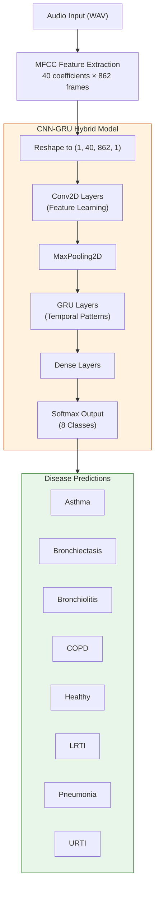
```mermaid
graph TD
    Input["Audio Input (WAV)"] --> MFCC["MFCC Feature Extraction<br/>40 coefficients × 862 frames"]
    MFCC --> Reshape["Reshape to (1, 40, 862, 1)"]

    subgraph CNN_GRU["CNN-GRU Hybrid Model"]
        Reshape --> Conv1["Conv2D Layers<br/>(Feature Learning)"]
        Conv1 --> Pool["MaxPooling2D"]
        Pool --> GRU1["GRU Layers<br/>(Temporal Patterns)"]
        GRU1 --> Dense["Dense Layers"]
        Dense --> Softmax["Softmax Output<br/>(8 Classes)"]
    end

    Softmax --> Output

    subgraph Output["Disease Predictions"]
        C1["Asthma"]
        C2["Bronchiectasis"]
        C3["Bronchiolitis"]
        C4["COPD"]
        C5["Healthy"]
        C6["LRTI"]
        C7["Pneumonia"]
        C8["URTI"]
    end

    style CNN_GRU fill:#FFF3E0,stroke:#E65100
    style Output fill:#E8F5E9,stroke:#2E7D32
```

---

## 6. WebSocket Real-Time Chat Architecture

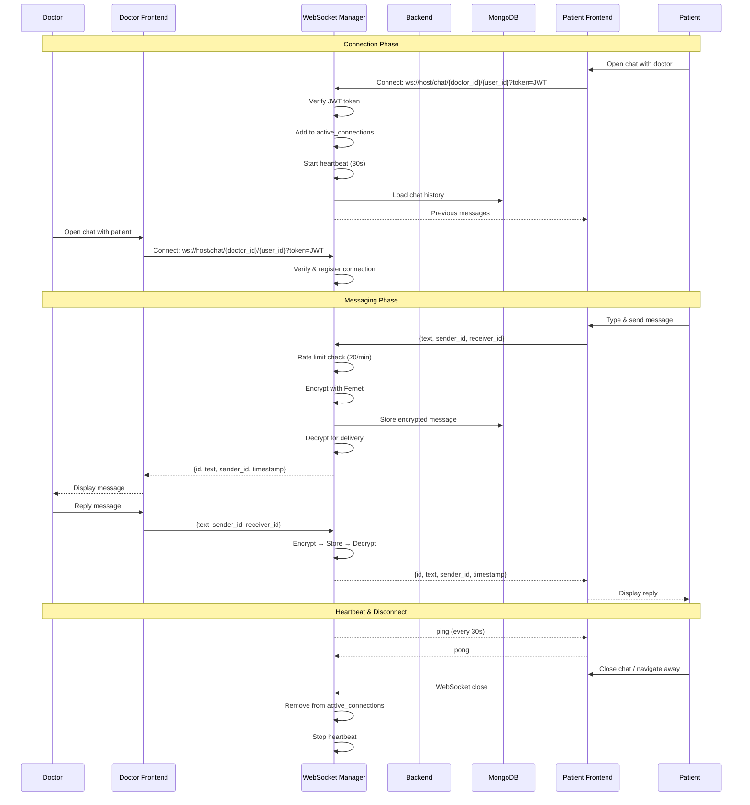
```mermaid
sequenceDiagram
    participant D as Doctor
    participant F_D as Doctor Frontend
    participant WS as WebSocket Manager
    participant B as Backend
    participant DB as MongoDB
    participant F_P as Patient Frontend
    participant P as Patient

    Note over D,P: Connection Phase
    P->>F_P: Open chat with doctor
    F_P->>WS: Connect: ws://host/chat/{doctor_id}/{user_id}?token=JWT
    WS->>WS: Verify JWT token
    WS->>WS: Add to active_connections
    WS->>WS: Start heartbeat (30s)
    WS->>DB: Load chat history
    WS-->>F_P: Previous messages

    D->>F_D: Open chat with patient
    F_D->>WS: Connect: ws://host/chat/{doctor_id}/{user_id}?token=JWT
    WS->>WS: Verify & register connection

    Note over D,P: Messaging Phase
    P->>F_P: Type & send message
    F_P->>WS: {text, sender_id, receiver_id}
    WS->>WS: Rate limit check (20/min)
    WS->>WS: Encrypt with Fernet
    WS->>DB: Store encrypted message
    WS->>WS: Decrypt for delivery
    WS-->>F_D: {id, text, sender_id, timestamp}
    F_D-->>D: Display message

    D->>F_D: Reply message
    F_D->>WS: {text, sender_id, receiver_id}
    WS->>WS: Encrypt → Store → Decrypt
    WS-->>F_P: {id, text, sender_id, timestamp}
    F_P-->>P: Display reply

    Note over D,P: Heartbeat & Disconnect
    WS-->>F_P: ping (every 30s)
    F_P-->>WS: pong

    P->>F_P: Close chat / navigate away
    F_P->>WS: WebSocket close
    WS->>WS: Remove from active_connections
    WS->>WS: Stop heartbeat
```

### WebSocket Connection Manager

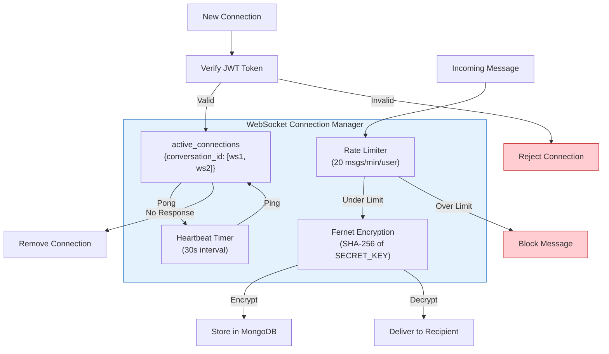
```mermaid
graph TD
    subgraph WebSocketManager["WebSocket Connection Manager"]
        AC["active_connections<br/>{conversation_id: [ws1, ws2]}"]
        HB["Heartbeat Timer<br/>(30s interval)"]
        RL["Rate Limiter<br/>(20 msgs/min/user)"]
        ENC["Fernet Encryption<br/>(SHA-256 of SECRET_KEY)"]
    end

    Connect["New Connection"] --> Auth["Verify JWT Token"]
    Auth -->|Valid| AC
    Auth -->|Invalid| Reject["Reject Connection"]

    Message["Incoming Message"] --> RL
    RL -->|Under Limit| ENC
    RL -->|Over Limit| Block["Block Message"]
    ENC -->|Encrypt| Store["Store in MongoDB"]
    ENC -->|Decrypt| Deliver["Deliver to Recipient"]

    HB -->|Ping| AC
    AC -->|Pong| HB
    AC -->|No Response| Disconnect["Remove Connection"]

    style WebSocketManager fill:#E3F2FD,stroke:#1565C0
    style Reject fill:#FFCDD2,stroke:#C62828
    style Block fill:#FFCDD2,stroke:#C62828
```

---

## 7. Appointment Management Flow

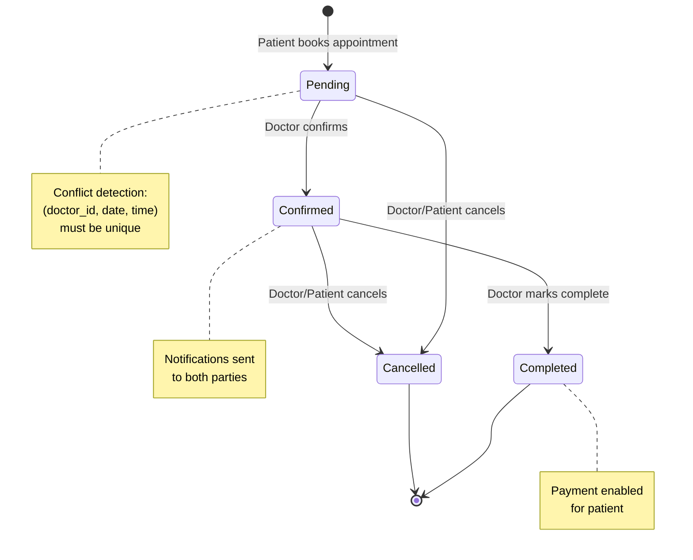
```mermaid
stateDiagram-v2
    [*] --> Pending: Patient books appointment

    Pending --> Confirmed: Doctor confirms
    Pending --> Cancelled: Doctor/Patient cancels

    Confirmed --> Completed: Doctor marks complete
    Confirmed --> Cancelled: Doctor/Patient cancels

    Completed --> [*]
    Cancelled --> [*]

    note right of Pending
        Conflict detection:
        (doctor_id, date, time)
        must be unique
    end note

    note right of Confirmed
        Notifications sent
        to both parties
    end note

    note right of Completed
        Payment enabled
        for patient
    end note
```

### Appointment Booking Sequence

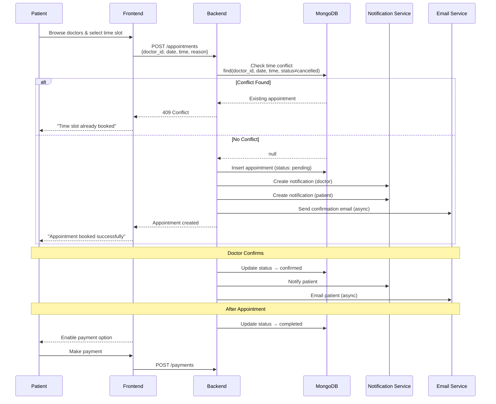
```mermaid
sequenceDiagram
    participant P as Patient
    participant F as Frontend
    participant B as Backend
    participant DB as MongoDB
    participant N as Notification Service
    participant E as Email Service

    P->>F: Browse doctors & select time slot
    F->>B: POST /appointments<br/>{doctor_id, date, time, reason}

    B->>DB: Check time conflict<br/>find(doctor_id, date, time, status≠cancelled)
    alt Conflict Found
        DB-->>B: Existing appointment
        B-->>F: 409 Conflict
        F-->>P: "Time slot already booked"
    else No Conflict
        DB-->>B: null
        B->>DB: Insert appointment (status: pending)
        B->>N: Create notification (doctor)
        B->>N: Create notification (patient)
        B->>E: Send confirmation email (async)
        B-->>F: Appointment created
        F-->>P: "Appointment booked successfully"
    end

    Note over P,E: Doctor Confirms
    B->>DB: Update status → confirmed
    B->>N: Notify patient
    B->>E: Email patient (async)

    Note over P,E: After Appointment
    B->>DB: Update status → completed
    F-->>P: Enable payment option
    P->>F: Make payment
    F->>B: POST /payments
```

---

## 8. Frontend Component Architecture

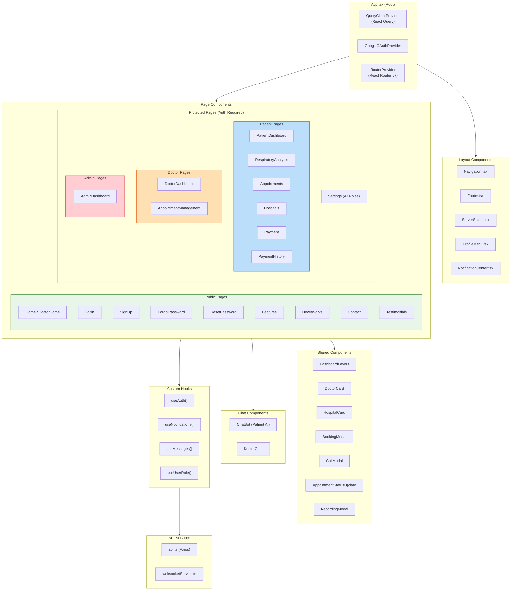
```mermaid
graph TD
    subgraph App["App.tsx (Root)"]
        QP["QueryClientProvider<br/>(React Query)"]
        GOP["GoogleOAuthProvider"]
        RP["RouterProvider<br/>(React Router v7)"]
    end

    subgraph Layout["Layout Components"]
        Nav["Navigation.tsx"]
        Footer["Footer.tsx"]
        SS["ServerStatus.tsx"]
        PM["ProfileMenu.tsx"]
        NC["NotificationCenter.tsx"]
    end

    subgraph Pages["Page Components"]
        subgraph Public["Public Pages"]
            Home["Home / DoctorHome"]
            Login["Login"]
            SignUp["SignUp"]
            FP["ForgotPassword"]
            RP2["ResetPassword"]
            Features["Features"]
            HIW["HowItWorks"]
            Contact["Contact"]
            Testimonials["Testimonials"]
        end

        subgraph Protected["Protected Pages (Auth Required)"]
            subgraph Patient["Patient Pages"]
                PD["PatientDashboard"]
                RA["RespiratoryAnalysis"]
                Appts["Appointments"]
                Hosp["Hospitals"]
                Pay["Payment"]
                PH["PaymentHistory"]
            end

            subgraph Doctor["Doctor Pages"]
                DD["DoctorDashboard"]
                AM["AppointmentManagement"]
            end

            subgraph Admin["Admin Pages"]
                AD["AdminDashboard"]
            end

            Settings["Settings (All Roles)"]
        end
    end

    subgraph SharedComponents["Shared Components"]
        DL["DashboardLayout"]
        DC["DoctorCard"]
        HC["HospitalCard"]
        BM["BookingModal"]
        CM["CallModal"]
        ASU["AppointmentStatusUpdate"]
        RM["RecordingModal"]
    end

    subgraph ChatComponents["Chat Components"]
        CB["ChatBot (Patient AI)"]
        DCh["DoctorChat"]
    end

    subgraph Hooks["Custom Hooks"]
        UA["useAuth()"]
        UN["useNotifications()"]
        UM["useMessages()"]
        UR["useUserRole()"]
    end

    subgraph Services["API Services"]
        API["api.ts (Axios)"]
        WSS["websocketService.ts"]
    end

    App --> Layout
    App --> Pages
    Pages --> SharedComponents
    Pages --> ChatComponents
    Pages --> Hooks
    Hooks --> Services

    style Public fill:#E8F5E9,stroke:#2E7D32
    style Patient fill:#BBDEFB,stroke:#1565C0
    style Doctor fill:#FFE0B2,stroke:#E65100
    style Admin fill:#FFCDD2,stroke:#C62828
```

### Frontend Routing Diagram

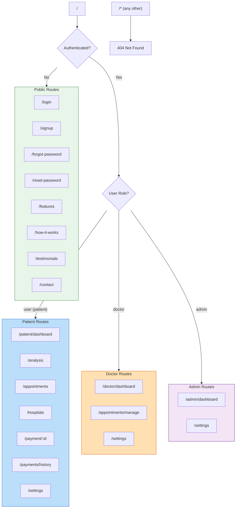
```mermaid
graph TD
    Root["/"] --> AuthCheck{"Authenticated?"}

    AuthCheck -->|No| PublicRoutes
    AuthCheck -->|Yes| RoleCheck{"User Role?"}

    subgraph PublicRoutes["Public Routes"]
        P1["/login"]
        P2["/signup"]
        P3["/forgot-password"]
        P4["/reset-password"]
        P5["/features"]
        P6["/how-it-works"]
        P7["/testimonials"]
        P8["/contact"]
    end

    RoleCheck -->|"user (patient)"| PatientRoutes
    RoleCheck -->|"doctor"| DoctorRoutes
    RoleCheck -->|"admin"| AdminRoutes

    subgraph PatientRoutes["Patient Routes"]
        PR1["/patient/dashboard"]
        PR2["/analysis"]
        PR3["/appointments"]
        PR4["/hospitals"]
        PR5["/payment/:id"]
        PR6["/payments/history"]
        PR7["/settings"]
    end

    subgraph DoctorRoutes["Doctor Routes"]
        DR1["/doctor/dashboard"]
        DR2["/appointments/manage"]
        DR3["/settings"]
    end

    subgraph AdminRoutes["Admin Routes"]
        AR1["/admin/dashboard"]
        AR2["/settings"]
    end

    Any["/* (any other)"] --> NF["404 Not Found"]

    style PublicRoutes fill:#E8F5E9,stroke:#2E7D32
    style PatientRoutes fill:#BBDEFB,stroke:#1565C0
    style DoctorRoutes fill:#FFE0B2,stroke:#E65100
    style AdminRoutes fill:#F3E5F5,stroke:#6A1B9A
```

---

## 9. API Endpoint Map

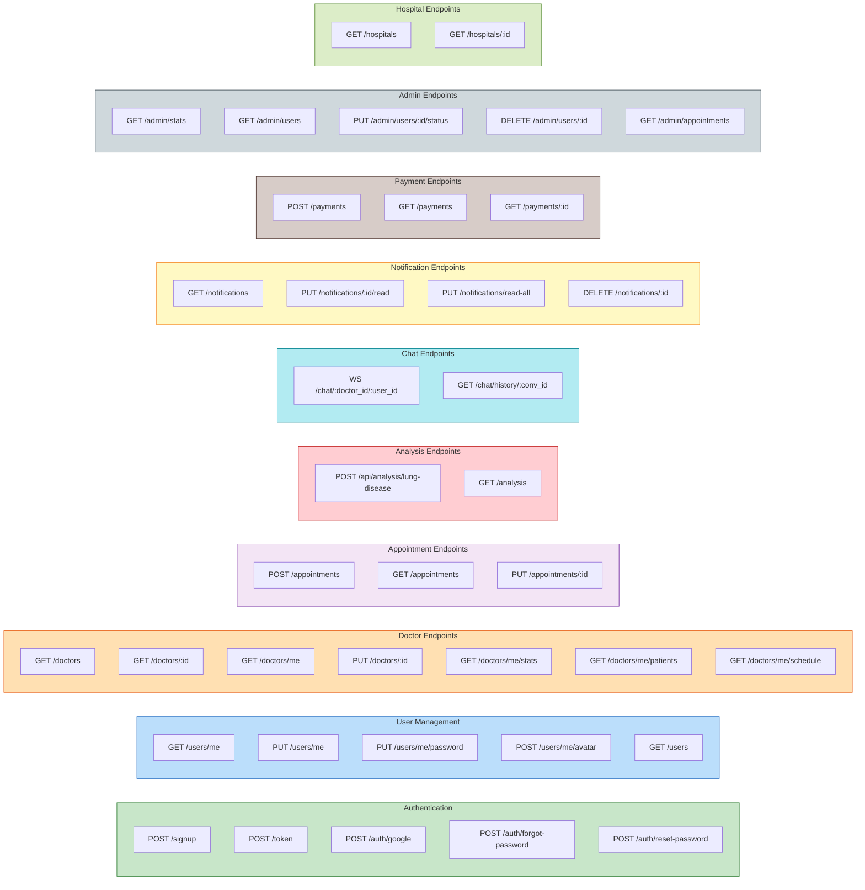
```mermaid
graph LR
    subgraph Auth["Authentication"]
        A1["POST /signup"]
        A2["POST /token"]
        A3["POST /auth/google"]
        A4["POST /auth/forgot-password"]
        A5["POST /auth/reset-password"]
    end

    subgraph User["User Management"]
        U1["GET /users/me"]
        U2["PUT /users/me"]
        U3["PUT /users/me/password"]
        U4["POST /users/me/avatar"]
        U5["GET /users"]
    end

    subgraph DocEP["Doctor Endpoints"]
        D1["GET /doctors"]
        D2["GET /doctors/:id"]
        D3["GET /doctors/me"]
        D4["PUT /doctors/:id"]
        D5["GET /doctors/me/stats"]
        D6["GET /doctors/me/patients"]
        D7["GET /doctors/me/schedule"]
    end

    subgraph ApptEP["Appointment Endpoints"]
        AP1["POST /appointments"]
        AP2["GET /appointments"]
        AP3["PUT /appointments/:id"]
    end

    subgraph AnalysisEP["Analysis Endpoints"]
        AN1["POST /api/analysis/lung-disease"]
        AN2["GET /analysis"]
    end

    subgraph ChatEP["Chat Endpoints"]
        C1["WS /chat/:doctor_id/:user_id"]
        C2["GET /chat/history/:conv_id"]
    end

    subgraph NotifEP["Notification Endpoints"]
        N1["GET /notifications"]
        N2["PUT /notifications/:id/read"]
        N3["PUT /notifications/read-all"]
        N4["DELETE /notifications/:id"]
    end

    subgraph PayEP["Payment Endpoints"]
        PY1["POST /payments"]
        PY2["GET /payments"]
        PY3["GET /payments/:id"]
    end

    subgraph AdminEP["Admin Endpoints"]
        AD1["GET /admin/stats"]
        AD2["GET /admin/users"]
        AD3["PUT /admin/users/:id/status"]
        AD4["DELETE /admin/users/:id"]
        AD5["GET /admin/appointments"]
    end

    subgraph HospEP["Hospital Endpoints"]
        H1["GET /hospitals"]
        H2["GET /hospitals/:id"]
    end

    style Auth fill:#C8E6C9,stroke:#2E7D32
    style User fill:#BBDEFB,stroke:#1565C0
    style DocEP fill:#FFE0B2,stroke:#E65100
    style ApptEP fill:#F3E5F5,stroke:#6A1B9A
    style AnalysisEP fill:#FFCDD2,stroke:#C62828
    style ChatEP fill:#B2EBF2,stroke:#00838F
    style NotifEP fill:#FFF9C4,stroke:#F57F17
    style PayEP fill:#D7CCC8,stroke:#4E342E
    style AdminEP fill:#CFD8DC,stroke:#37474F
    style HospEP fill:#DCEDC8,stroke:#558B2F
```

---

## 10. Deployment Architecture

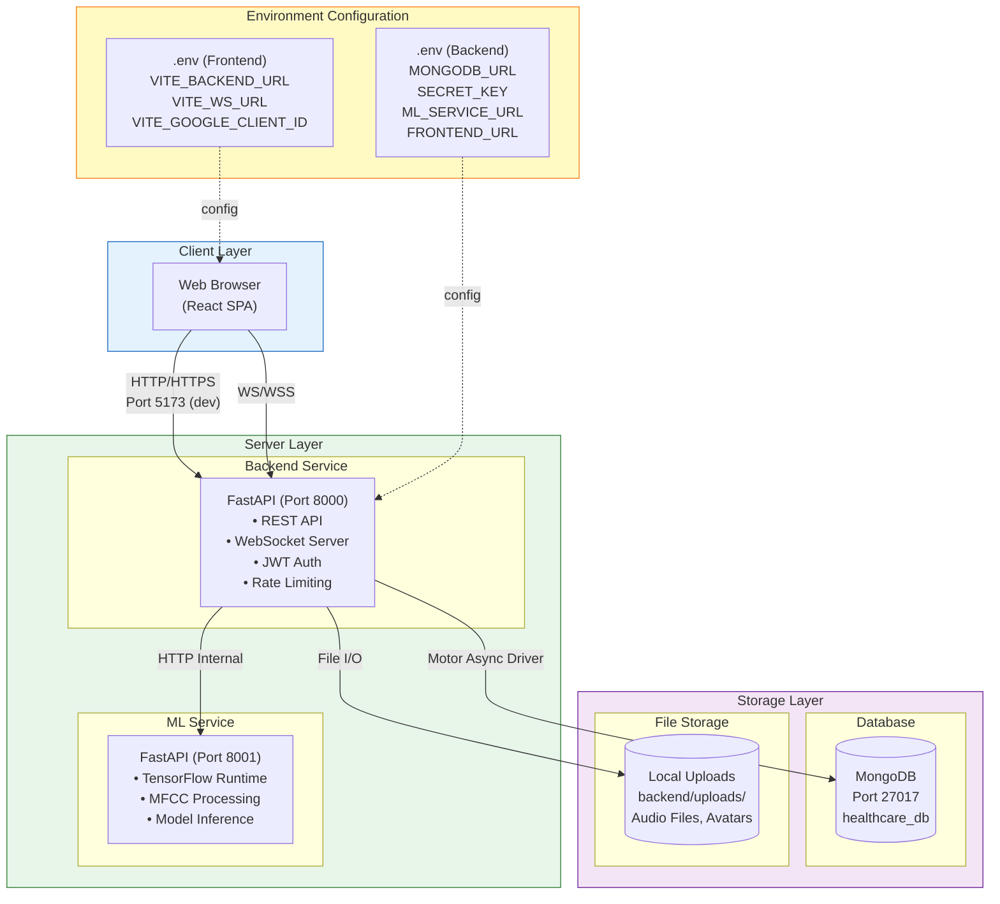
```mermaid
graph TB
    subgraph Client_Layer["Client Layer"]
        Browser["Web Browser<br/>(React SPA)"]
    end

    subgraph Server_Layer["Server Layer"]
        subgraph Backend_Container["Backend Service"]
            BE["FastAPI (Port 8000)<br/>• REST API<br/>• WebSocket Server<br/>• JWT Auth<br/>• Rate Limiting"]
        end

        subgraph ML_Container["ML Service"]
            MLS["FastAPI (Port 8001)<br/>• TensorFlow Runtime<br/>• MFCC Processing<br/>• Model Inference"]
        end
    end

    subgraph Storage_Layer["Storage Layer"]
        subgraph DB_Container["Database"]
            MDB[(MongoDB<br/>Port 27017<br/>healthcare_db)]
        end

        subgraph File_Container["File Storage"]
            FS[("Local Uploads<br/>backend/uploads/<br/>Audio Files, Avatars")]
        end
    end

    subgraph Env_Config["Environment Configuration"]
        BE_ENV[".env (Backend)<br/>MONGODB_URL<br/>SECRET_KEY<br/>ML_SERVICE_URL<br/>FRONTEND_URL"]
        FE_ENV[".env (Frontend)<br/>VITE_BACKEND_URL<br/>VITE_WS_URL<br/>VITE_GOOGLE_CLIENT_ID"]
    end

    Browser -->|"HTTP/HTTPS<br/>Port 5173 (dev)"| BE
    Browser -->|"WS/WSS"| BE
    BE -->|"HTTP Internal"| MLS
    BE -->|"Motor Async Driver"| MDB
    BE -->|"File I/O"| FS
    BE_ENV -.->|config| BE
    FE_ENV -.->|config| Browser

    style Client_Layer fill:#E3F2FD,stroke:#1565C0
    style Server_Layer fill:#E8F5E9,stroke:#2E7D32
    style Storage_Layer fill:#F3E5F5,stroke:#6A1B9A
    style Env_Config fill:#FFF9C4,stroke:#F57F17
```

### Production Deployment (Recommended)

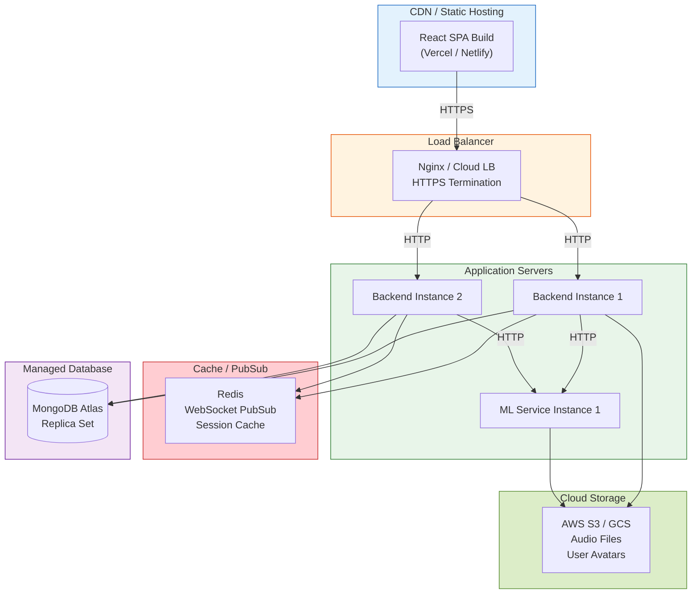
```mermaid
graph TB
    subgraph CDN["CDN / Static Hosting"]
        SPA["React SPA Build<br/>(Vercel / Netlify)"]
    end

    subgraph LB["Load Balancer"]
        Nginx["Nginx / Cloud LB<br/>HTTPS Termination"]
    end

    subgraph App_Servers["Application Servers"]
        BE1["Backend Instance 1"]
        BE2["Backend Instance 2"]
        ML1["ML Service Instance 1"]
    end

    subgraph Cache_Layer["Cache / PubSub"]
        Redis["Redis<br/>WebSocket PubSub<br/>Session Cache"]
    end

    subgraph DB_Layer["Managed Database"]
        Atlas[(MongoDB Atlas<br/>Replica Set)]
    end

    subgraph Storage["Cloud Storage"]
        S3["AWS S3 / GCS<br/>Audio Files<br/>User Avatars"]
    end

    SPA -->|HTTPS| Nginx
    Nginx -->|HTTP| BE1
    Nginx -->|HTTP| BE2
    BE1 -->|HTTP| ML1
    BE2 -->|HTTP| ML1
    BE1 --> Redis
    BE2 --> Redis
    BE1 --> Atlas
    BE2 --> Atlas
    BE1 --> S3
    ML1 --> S3

    style CDN fill:#E3F2FD,stroke:#1565C0
    style LB fill:#FFF3E0,stroke:#E65100
    style App_Servers fill:#E8F5E9,stroke:#2E7D32
    style Cache_Layer fill:#FFCDD2,stroke:#C62828
    style DB_Layer fill:#F3E5F5,stroke:#6A1B9A
    style Storage fill:#DCEDC8,stroke:#558B2F
```

---

## 11. Security Architecture

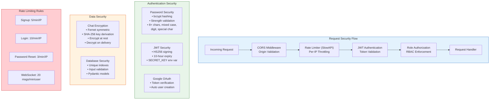
```mermaid
graph TD
    subgraph Request_Flow["Request Security Flow"]
        Req["Incoming Request"] --> CORS_Check["CORS Middleware<br/>Origin Validation"]
        CORS_Check --> Rate_Check["Rate Limiter (SlowAPI)<br/>Per-IP Throttling"]
        Rate_Check --> Auth_Check["JWT Authentication<br/>Token Validation"]
        Auth_Check --> Role_Check["Role Authorization<br/>RBAC Enforcement"]
        Role_Check --> Handler["Request Handler"]
    end

    subgraph Auth_Security["Authentication Security"]
        PWD["Password Security<br/>• bcrypt hashing<br/>• Strength validation<br/>• 8+ chars, mixed case,<br/>  digit, special char"]
        JWT_S["JWT Security<br/>• HS256 signing<br/>• 10-hour expiry<br/>• SECRET_KEY env var"]
        OAuth["Google OAuth<br/>• Token verification<br/>• Auto user creation"]
    end

    subgraph Data_Security["Data Security"]
        MSG_ENC["Chat Encryption<br/>• Fernet symmetric<br/>• SHA-256 key derivation<br/>• Encrypt at rest<br/>• Decrypt on delivery"]
        DB_SEC["Database Security<br/>• Unique indexes<br/>• Input validation<br/>• Pydantic models"]
    end

    subgraph Rate_Limits["Rate Limiting Rules"]
        RL1["Signup: 5/min/IP"]
        RL2["Login: 10/min/IP"]
        RL3["Password Reset: 3/min/IP"]
        RL4["WebSocket: 20 msgs/min/user"]
    end

    style Request_Flow fill:#E3F2FD,stroke:#1565C0
    style Auth_Security fill:#E8F5E9,stroke:#2E7D32
    style Data_Security fill:#FFF3E0,stroke:#E65100
    style Rate_Limits fill:#FFCDD2,stroke:#C62828
```

---

## 12. Notification System Flow

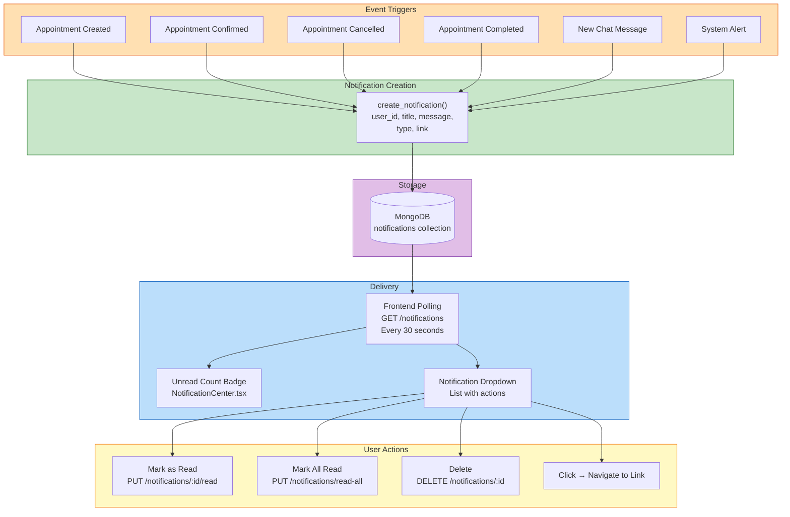
```mermaid
graph TD
    subgraph Triggers["Event Triggers"]
        T1["Appointment Created"]
        T2["Appointment Confirmed"]
        T3["Appointment Cancelled"]
        T4["Appointment Completed"]
        T5["New Chat Message"]
        T6["System Alert"]
    end

    subgraph Create["Notification Creation"]
        CN["create_notification()<br/>user_id, title, message,<br/>type, link"]
    end

    subgraph Store["Storage"]
        DB[(MongoDB<br/>notifications collection)]
    end

    subgraph Delivery["Delivery"]
        Poll["Frontend Polling<br/>GET /notifications<br/>Every 30 seconds"]
        Badge["Unread Count Badge<br/>NotificationCenter.tsx"]
        List["Notification Dropdown<br/>List with actions"]
    end

    subgraph Actions["User Actions"]
        Read["Mark as Read<br/>PUT /notifications/:id/read"]
        ReadAll["Mark All Read<br/>PUT /notifications/read-all"]
        Delete["Delete<br/>DELETE /notifications/:id"]
        Navigate["Click → Navigate to Link"]
    end

    T1 & T2 & T3 & T4 & T5 & T6 --> CN
    CN --> DB
    DB --> Poll
    Poll --> Badge
    Poll --> List
    List --> Read & ReadAll & Delete & Navigate

    style Triggers fill:#FFE0B2,stroke:#E65100
    style Create fill:#C8E6C9,stroke:#2E7D32
    style Store fill:#E1BEE7,stroke:#6A1B9A
    style Delivery fill:#BBDEFB,stroke:#1565C0
    style Actions fill:#FFF9C4,stroke:#F57F17
```

---

## Summary

| Component | Technology | Port | Purpose |
|-----------|-----------|------|---------|
| Frontend | React 19 + TypeScript + Vite | 5173 | Single Page Application |
| Backend API | FastAPI (Python) | 8000 | REST API + WebSocket |
| ML Service | FastAPI + TensorFlow | 8001 | Disease Prediction |
| Database | MongoDB | 27017 | Data Persistence |
| Real-time | WebSocket | 8000 | Doctor-Patient Chat |

**Key Architectural Decisions:**
- **Microservices**: Separated ML inference from main API to prevent blocking and allow independent scaling
- **Async I/O**: Motor (async MongoDB driver) + FastAPI for non-blocking database operations
- **JWT Auth**: Stateless authentication with role-based access control
- **Message Encryption**: Fernet symmetric encryption for chat message privacy
- **React Query**: Server-state management with automatic caching and background refetching
- **WebSocket**: Bidirectional real-time communication with heartbeat and reconnection logic
